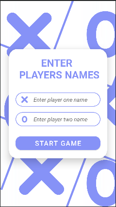
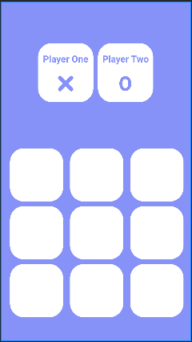

# Tic Tac Toe

This is *Tic Tac Toe* android app, developed by me in my first year of learning android development.This simple yet classic game allows two players to compete against each other on a 3x3 grid. The objective is to be the first to form a horizontal, vertical, or diagonal line of three of your symbols (X or O) on the grid. 

## Preview
This app is build with Java in Android Studio. 

<!--  -->
<!-- HTML -->

## How to Run

You will need Android Studio 2022.1.1 Patch 1 or above.

- Download the ZIP from the gitHub page and unzip it.
- Open Android Studio.
- Click on the OPEN button and select the unziped folder.
- Click on Trust project if asked to.
- Wait for gradle to download necessary packages.
- Select your Emulator and click on Run app button.
- Enjoy!

## Installation

- Download the latest apk version from the Release (gitHub Repository).
- Allow your android device to install from the unknown source if not allowed.
- Find the app in the app drawer of your android device.
- Enjoy!

## Future Plans

-*Graphical User Interface (GUI)*: I am working on creating a graphical version of the game using a Java GUI library, making the gameplay more interactive and visually appealing.
-*Multiplayer Mode*: I aim to implement a multiplayer mode that will allow players to play against each other over a network connection.
-*Difficulty Levels*: I plan to add different difficulty levels for single-player mode, introducing smarter AI opponents for a more challenging experience.
-*Enhanced Customization*: I will provide options to customize the game's appearance, such as choosing different board themes and player symbols.
-*Game Statistics*: Implementing a feature to keep track of game statistics, including wins, losses, and ties, to provide players with a sense of accomplishment.
-*Code Refinement*: Continuously improving the codebase, optimizing performance, and ensuring maintainability for the long term.

Thank you for your interest in the Tic Tac Toe Game App! I hope you enjoy playing it as much as I enjoyed creating it. If you have any questions or feedback, please don't hesitate to reach out.
